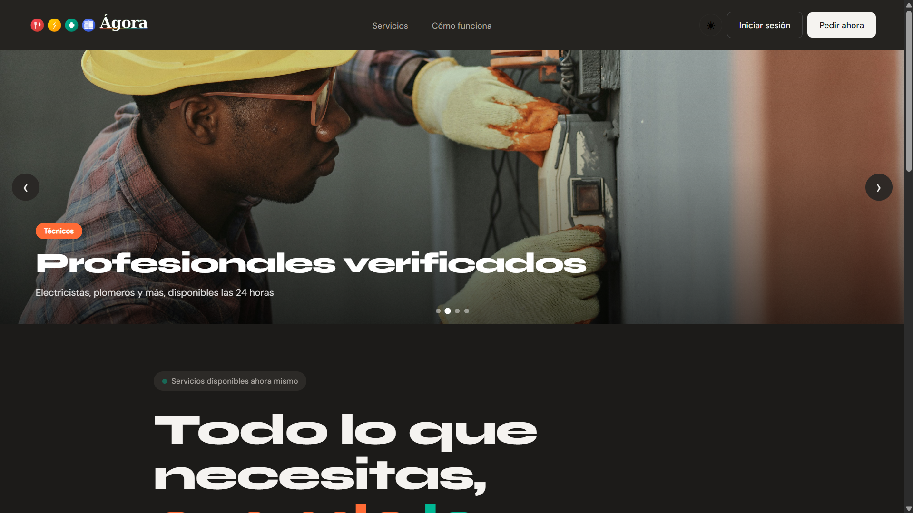
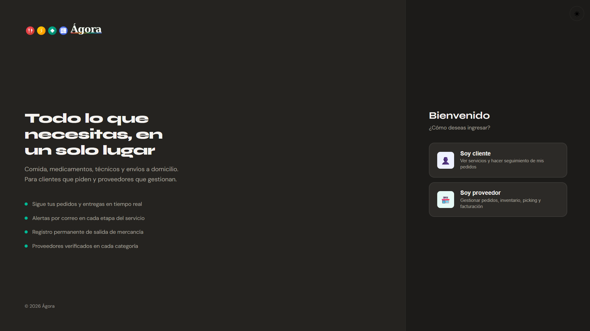
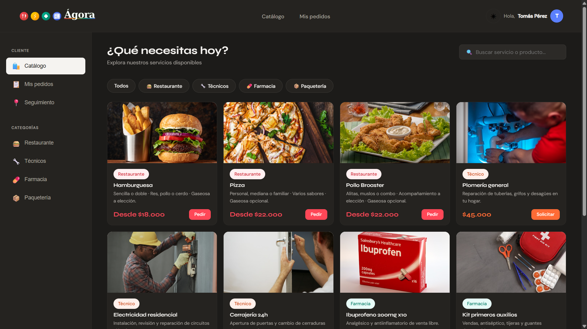
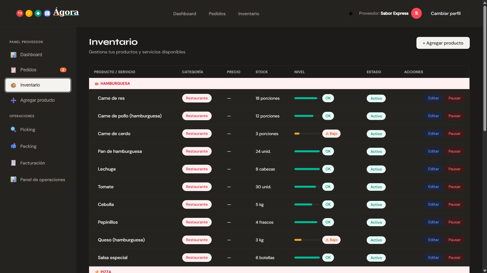

# Ágora — Plataforma de Gestión de Servicios y Pedidos

Aplicación web multi-rol que conecta clientes con proveedores de servicios, con gestión de inventario, flujo operativo completo y API REST funcional.

Proyecto académico — Materia Lógica de Programación · Instituto Tecnológico Metropolitano (ITM), 2026.

---

## 📸 Demo visual

Aplicación funcionando con datos reales sobre Docker (Nginx + Flask + SQLite).

|  |  |
|---|---|
| **Landing principal** — Hero con carousel de categorías y CTA de acceso. | **Selección de rol** — Onboarding multi-rol (cliente o proveedor). |
|  |  |
| **Panel del cliente** — Catálogo de servicios con filtros por categoría. | **Panel del proveedor** — Gestión de inventario y operaciones. |

---

## 🗂️ Estado actual del proyecto

| Componente | Estado | Detalle |
|---|---|---|
| Frontend (HTML/CSS/JS) | ✅ Implementado | Landing, login, paneles cliente y proveedor, flujo operativo |
| API REST (Flask) | ✅ Implementado | 8 endpoints en 3 blueprints, SQLite, autenticación con hash |
| Modelos de datos | ✅ Implementado | 4 modelos con relaciones y cascade |
| Tema claro/oscuro | ✅ Implementado | Persistido en `localStorage` |
| Orquestación con Docker Compose | ✅ Implementado | Frontend (Nginx) + Backend (Flask) en contenedores |
| Base de datos relacional (PostgreSQL) | 🔜 Planeado | Actualmente SQLite vía SQLAlchemy |
| Tareas asíncronas (Celery + Redis) | 🔜 Planeado | No implementado |
| Notificaciones por correo (Gmail SMTP) | 🔜 Planeado | No implementado |
| Servidor WSGI de producción (Gunicorn) | 🔜 Planeado | Actualmente Flask dev server |
| Calificaciones de servicio | 🔜 Planeado | No implementado |

---

## 🏗️ Arquitectura

```
┌─────────────────────────────────────────────────────────┐
│                    docker compose                       │
│                                                         │
│  ┌──────────────────┐         ┌──────────────────┐      │
│  │ Frontend         │  HTTP   │ Backend          │      │
│  │ nginx:alpine     │ ──────► │ python:3.11-slim │      │
│  │ Puerto :8003     │         │ Puerto :5000     │      │
│  │ HTML / CSS / JS  │         │ Flask + CORS     │      │
│  └──────────────────┘         │ SQLAlchemy       │      │
│                               │ SQLite (agora.db)│      │
│                               └──────────────────┘      │
└─────────────────────────────────────────────────────────┘
```

---

## ✨ Características implementadas

### Frontend

- **Landing page** (`index.html`) — presentación de las cuatro categorías de servicio
- **Autenticación** (`pages/login.html`) — selección de rol (cliente / proveedor) y categoría
- **Panel del cliente** (`pages/cliente.html`) — catálogo de servicios, creación y seguimiento de pedidos
- **Panel del proveedor** (`pages/proveedor.html`) — gestión de pedidos entrantes, control de inventario
- **Dashboard de inventario** (`pages/dashboard.html`) — KPIs, alertas de stock mínimo
- **Flujo operativo** (`pages/picking.html`, `pages/packing.html`, `pages/facturacion.html`) — operaciones internas del proveedor
- **Sistema de tema** (`js/tema.js`) — modo claro/oscuro con persistencia en `localStorage`

Las cuatro categorías de servicio soportadas:

| Categoría | Descripción |
|---|---|
| Restaurante | Comida a domicilio |
| Servicios técnicos | Ferretería / técnicos del hogar |
| Farmacia | Medicamentos e insumos de salud |
| Paquetería | Empresa de envíos y mensajería |

### Backend

API REST construida con Flask + SQLAlchemy, organizada en tres blueprints:

**Autenticación** (`/api/auth`)
- Registro de usuarios con hash seguro de contraseña (`werkzeug`), validación de rol y categoría
- Login con verificación de credenciales

**Pedidos** (`/api/pedidos`)
- Creación de pedidos con múltiples ítems (líneas de detalle)
- Listado de pedidos filtrado por cliente o proveedor
- Cambio de estado del pedido a lo largo del ciclo de vida

**Inventario** (`/api/productos`)
- Listado de productos con filtros por categoría y proveedor
- Creación de productos
- Edición parcial de productos (precio, stock, estado activo)

---

## 🔌 API REST

| Método | Endpoint | Descripción |
|---|---|---|
| `GET` | `/api/health` | Health check del servidor |
| `POST` | `/api/auth/registro` | Registro de usuario (rol, categoría, hash de password) |
| `POST` | `/api/auth/login` | Login con verificación de credenciales |
| `POST` | `/api/pedidos/` | Crear pedido con detalles (múltiples ítems) |
| `GET` | `/api/pedidos/?cliente_id=X` | Listar pedidos de un cliente |
| `GET` | `/api/pedidos/?proveedor_id=X` | Listar pedidos de un proveedor |
| `PUT` | `/api/pedidos/<id>/estado` | Cambiar estado de un pedido |
| `GET` | `/api/productos/?categoria=X&proveedor_id=Y` | Listar productos con filtros opcionales |
| `POST` | `/api/productos/` | Crear producto |
| `PUT` | `/api/productos/<id>` | Editar producto (actualizaciones parciales) |

---

## 🗃️ Modelos de datos

**`Usuario`**

| Campo | Tipo | Descripción |
|---|---|---|
| `id` | Integer PK | Identificador |
| `nombre` | String(120) | Nombre completo |
| `usuario` | String(80) unique | Nombre de usuario |
| `email` | String(200) unique | Correo electrónico |
| `password_hash` | String(256) | Hash de contraseña (werkzeug) |
| `rol` | String(20) | `cliente` o `proveedor` |
| `categoria_proveedor` | String(30) | `restaurante`, `tecnico`, `farmacia`, `paqueteria` |

**`Producto`**

| Campo | Tipo | Descripción |
|---|---|---|
| `id` | Integer PK | Identificador |
| `nombre` | String(200) | Nombre del producto |
| `precio` | Float | Precio unitario |
| `stock` | Integer | Unidades disponibles |
| `stock_minimo` | Integer | Umbral de alerta (default: 5) |
| `categoria` | String(30) | Categoría del proveedor |
| `proveedor_id` | FK → usuarios | Proveedor propietario |
| `activo` | Boolean | Visible en catálogo |

**`Pedido`**

| Campo | Tipo | Descripción |
|---|---|---|
| `id` | Integer PK | Identificador |
| `cliente_id` | FK → usuarios | Cliente que solicita |
| `proveedor_id` | FK → usuarios | Proveedor asignado |
| `estado` | String(20) | `recibido` → `aceptado` → `preparando` → `en_camino` → `entregado` / `cancelado` |
| `total` | Float | Monto total calculado |
| `direccion` | String(300) | Dirección de entrega |

**`DetallePedido`**

| Campo | Tipo | Descripción |
|---|---|---|
| `id` | Integer PK | Identificador |
| `pedido_id` | FK → pedidos (cascade) | Pedido padre |
| `producto_id` | FK → productos | Producto incluido |
| `cantidad` | Integer | Unidades |
| `precio_unitario` | Float | Precio al momento del pedido |

---

## ⚙️ Stack técnico

### Implementado actualmente

| Tecnología | Rol |
|---|---|
| HTML5 / CSS3 | Estructura y estilos de todas las vistas |
| JavaScript vanilla | Lógica del cliente, sin frameworks ni dependencias |
| Flask | Framework web del servidor |
| Flask-SQLAlchemy | ORM — mapeo de modelos a base de datos |
| Flask-CORS | Habilitación de CORS para peticiones del frontend |
| Werkzeug | Hash seguro de contraseñas |
| SQLite | Base de datos embebida (desarrollo) |
| Docker | Contenerización del backend (Python + Flask) |
| Docker Compose | Orquestación de servicios (frontend Nginx + backend Flask) |

### Roadmap / próximos pasos

| Tecnología | Propósito |
|---|---|
| PostgreSQL | Reemplazar SQLite en entornos de producción |
| Gunicorn | Servidor WSGI para despliegue productivo |
| Celery + Redis | Tareas asíncronas (notificaciones por correo) |
| Gmail SMTP | Envío de correos en cambios de estado del pedido |

---

## Instalación y ejecución

### Opción 1 — Docker Compose (recomendado)

Levanta toda la aplicación con un solo comando:

```bash
git clone https://github.com/tomaspro56/Agora.git
cd Agora
docker compose up -d
```

Servicios disponibles:
- Frontend: http://localhost:8003
- API Backend: http://localhost:5000

Para detener:
```bash
docker compose down
```

> **Base de datos:** SQLite se crea automáticamente en `backend/instance/agora.db` al primer arranque, con todas las tablas vacías. El archivo está ignorado por git, así que cada despliegue arranca con una base limpia.

### Opción 2 — Ejecución manual (desarrollo)

Útil para modificar código del backend con hot-reload de Flask.

#### Frontend

Abrir `index.html` con Live Server (extensión de VS Code) en http://127.0.0.1:5500.

#### Backend

```bash
cd backend
python3 -m venv venv
source venv/bin/activate
pip install -r requirements.txt
python app.py
```

API disponible en http://localhost:5000. La base de datos SQLite (`agora.db`) se crea automáticamente en el primer arranque.

---

## Estructura del proyecto

```
Agora/
├── index.html                      # Landing page
├── css/
│   └── styles.css                  # Hoja de estilos global
├── js/
│   ├── tema.js                     # Gestor de tema claro/oscuro
│   ├── login.js                    # Lógica de autenticación
│   ├── picking.js                  # Interacciones del flujo de picking
│   └── facturacion.js              # Interacciones del flujo de facturación
├── pages/
│   ├── login.html                  # Inicio de sesión con selección de rol
│   ├── cliente.html                # Panel del cliente
│   ├── proveedor.html              # Panel del proveedor
│   ├── dashboard.html              # Dashboard de inventario
│   ├── picking.html                # Operación de picking
│   ├── packing.html                # Operación de packing
│   └── facturacion.html            # Facturación y cierre
├── imagenes/
│   ├── logo/
│   │   ├── agoraN.png              # Logo tema claro
│   │   └── agoraO.png              # Logo tema oscuro
│   ├── comida.jpg
│   ├── electricista.jpg
│   ├── farmacia.jpg
│   └── paquetes.jpg
├── backend/
│   ├── app.py                      # Punto de entrada Flask, registro de blueprints
│   ├── models.py                   # Modelos SQLAlchemy
│   ├── requirements.txt
│   ├── Dockerfile
│   ├── instance/                   # Generado automáticamente — contiene agora.db (ignorado por git)
│   └── routes/
│       ├── auth.py                 # Blueprint /api/auth
│       ├── pedidos.py              # Blueprint /api/pedidos
│       └── inventario.py           # Blueprint /api/productos
├── DiagramaFlujo/
│   └── Agora.drawio
├── docker-compose.yml
└── README.md
```

---

## Equipo

Proyecto académico. Equipo de desarrollo:

| Integrante | Rol principal |
|---|---|
| Tomás Pérez | Arquitectura, backend (Flask, SQLAlchemy, Docker), frontend |
| Yesica | Frontend |
| Daniel | Frontend |
| Juan Manuel | Frontend |
